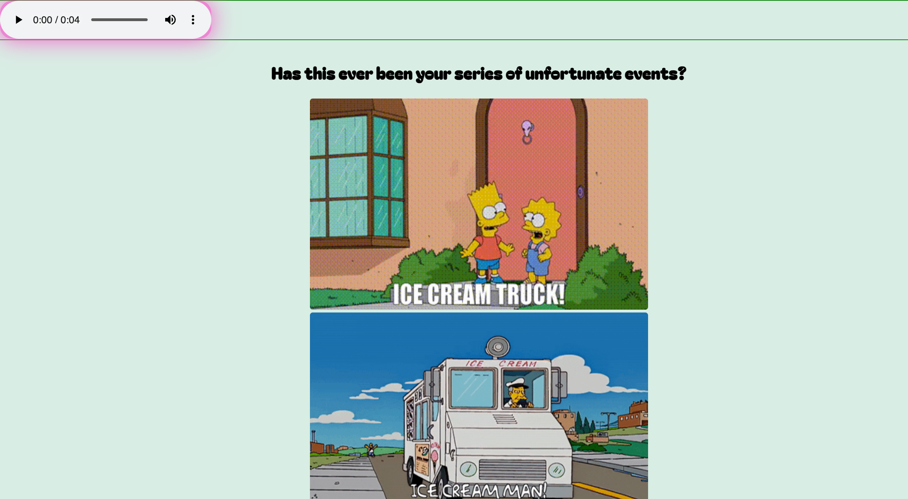

This codebase lives as the server side for [WMIC](https://github.com/anickacodes/AL-Capstone-Frontend)
<!--  -->
    Technologies utilized are: 
     PostgrSQL
     Express.js
     Firebase Admin
     Websocket
     Axios
     Cors

Want to test it out on your local computer? 
<!--  -->

Things you'll need : 
- A firebase [project](https://console.firebase.google.com/u/0/?_gl=1*1qm9t8q*_ga*MTY5NDI4NTc5MC4xNzE0Mzk5NTE2*_ga_CW55HF8NVT*MTcxNDg4MzI0MS40NC4wLjE3MTQ4ODMyNDEuNjAuMC4w) set up in your firebase console so you can get the admin keys 
- A local environment

Just follow these steps . . .
1. `Fork & clone` this repo 
2. Ensure your CLI is in the directory you've cloned the repo into
3. `npm install`

4. You'll need to set up your `.env` with the following keys : 

<!-- - update the html instead of the 1 liner 
- this server was built specifically for the client side application for Where's My Ice Cream
- this server side utilizes [add technologies]
- how users can interact with this ... keys needed  -->
